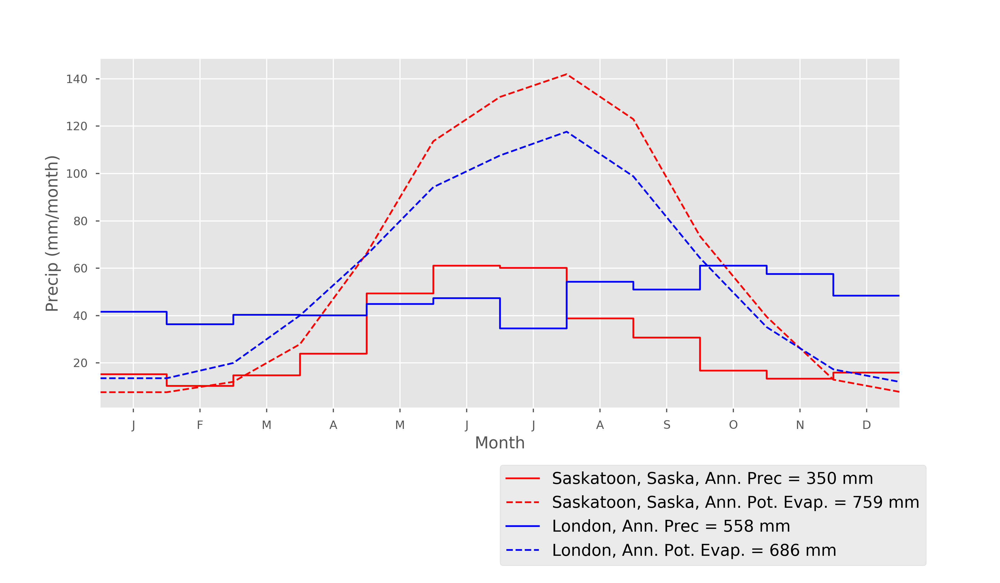

# Hydrology of World Cities

This script obtains an estimate of average monthly rainfall and potential evapotranpiration for all the major world cities. The script obtains monthly climate data from the WMO website, and location data from the python basemap library. Potential evapotranspiration is estimated using the FAO 56 method. This information provides a first order understanding of the hydrology of any particular location. 

This script is written in jupyter notebook, using python version 3.6

# Example run: Saskatoon, Canada versus London, UK

Here, outputs from this tool are shown for Saskatoon, Canada, and London, UK, using the three figures produced by the tool, and the discussion provides an example of these data can be used to draw insights about how the hydrology of these places works. Saskatoon and London provide a nice comparison, since these cities have almost exactly the same latitude (London is 51.5$^\circ$ N, Sasatoon is 52.1 $^\circ$ N):

Due to the effects of the Gulf stream, and the coastal versus continental climate, the temperatures are vastly different:

Again, due to the vicinitiy of the ocean, London has far more precipitation than Saskatoon, and while London has a fairly even distribution of precipitation over the yaer, with only subtle seasonal variation, Saksatoon has the bulk of it's precipitation in the summer months. Potential evaporation, on the other hand, is fairly similar in both Saskatoon and London. This results in Saksatoon experiencing a semi-arid climate.

For this data we can infer that London receives a net input of water during the winter months, when precipitation is high, relative to potential evaporation, and this is when most groundwater recharge and runoff generation will occur. Saskatoon also only experiences a postive net effective precipitation in the winter, but due to the low temperature, all the water is held up in the snowpack until the spring when melt occurs, providing the most significant input of water for soil and groundwater recharge and runoff generation in the year.
